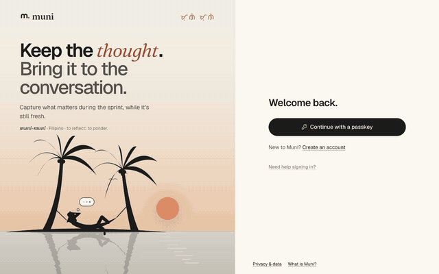

# Muni

**Keep the thought. Bring it to the conversation.**

Muni is a sprint-retrospective app. Capture what matters during the sprint while it's fresh, then have a real conversation about what happened and what to change.

Try it at [act.munimuni.app](https://act.munimuni.app).

The retro from both sides, in 30 seconds: <a href="docs/demo/muni-journey.mp4">muni-journey.mp4</a>

## How it works

- **Private capture.** Your thoughts stay hidden until collection closes — even from the facilitator.
- **Blind reveal.** When collection closes, all thoughts appear at once on the sprint's page, unnamed and in random order — for everyone to read before the retro.
- **Themes and voting.** The facilitator can gather thoughts into themes; when there are themes, everyone votes on what to talk about first.
- **Live retrospective.** Four steps — look back, choose, talk, agree — on a shared screen with everyone's phone alongside: quick private check-ins and additions let people take part without having to speak first, and one to three experiments come back first next sprint.
- **Keeps writing offline.** Write without a connection; thoughts are sent when you're back. Drafts stay in the tab unless you choose to keep them on the device.

Sprints are encrypted on your team's devices by default: thoughts, themes, notes, experiments and the recap are sealed before they reach Muni's servers, which don't hold the keys. Names, dates, categories and who wrote what stay readable to the server — never to teammates. A facilitator can set a sprint up without encryption, and that sprint says so. See [`docs/privacy-claims.md`](docs/privacy-claims.md) for each claim and its evidence.

## What you should know

- **A release candidate.** Built by one person. 1.0.0-rc.1 is the first release; what it stores keeps working through every 1.x release ([`docs/RELEASING.md`](docs/RELEASING.md) §2). The API is the app's own, not a public one.
- **Passkeys only.** No email, password, or social sign-in — use a passkey to sign in. Losing all your passkeys means losing access to your account.
- **Cloudflare only.** Runs on Cloudflare Workers; no other deployments are supported.
- **English only** for now.
- **Browsers.** Tested by hand on Chrome and Firefox on desktop, Safari on iPhone and Chrome on Android; the automated suites run in Chromium.
- **Encryption limits.** Muni's encryption hasn't been independently audited. The server still records who wrote what (teammates never see it), and in a small team the wording itself can give an author away.
- **No self-service purge.** You can leave a workspace and delete your account, but not purge a finished sprint early or download everything you've written.

## For contributors and hosters

- **Contributing:** Read [`CONTRIBUTING.md`](CONTRIBUTING.md) first.
- **Security:** Report vulnerabilities privately in [`SECURITY.md`](SECURITY.md).
- **Self-hosting:** See [`docs/DEPLOYMENT.md`](docs/DEPLOYMENT.md).
- **Development:** Node 22+, pnpm 10. In `web/`: `npm ci && npm run build` (the Worker serves the built app). In `worker/`: `pnpm install && pnpm migrate:local && pnpm dev`, then open http://localhost:8787. For live reloading while you change the app, also run `npm run dev` in `web/` and open http://localhost:5173 (it passes `/api` to the Worker). No Cloudflare account needed for local development.

## License

Apache License 2.0 — see [`LICENSE`](LICENSE). The Muni name and logo are covered in [`TRADEMARKS.md`](TRADEMARKS.md).
